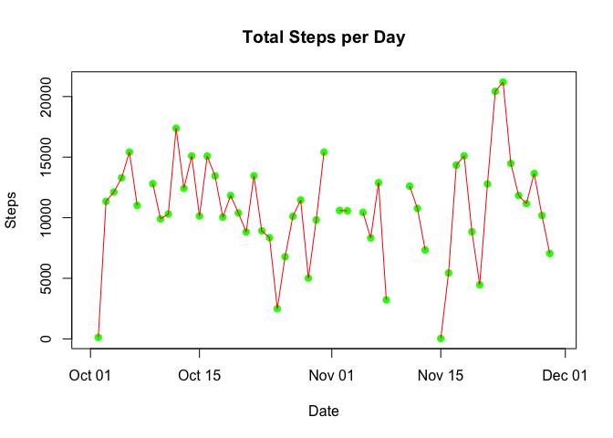
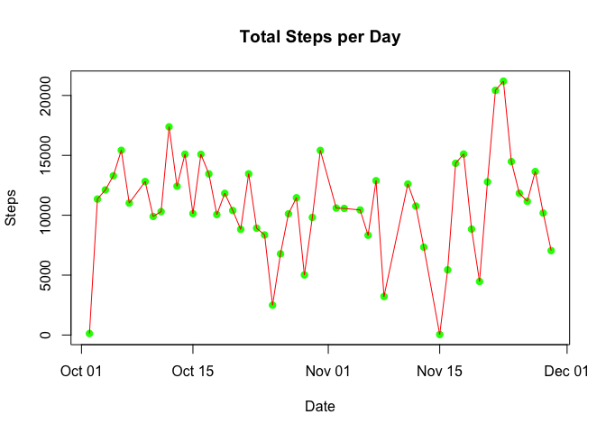
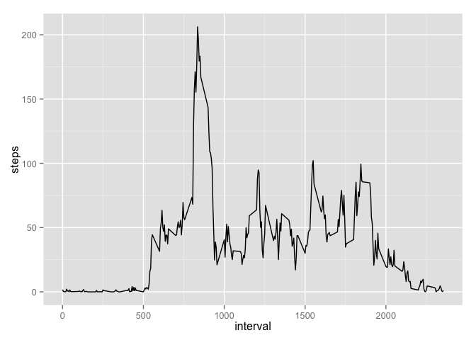
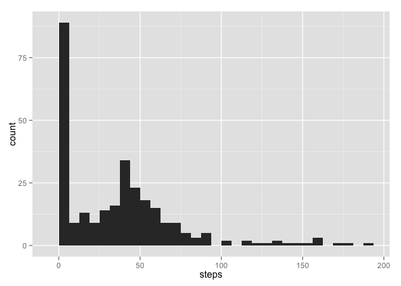
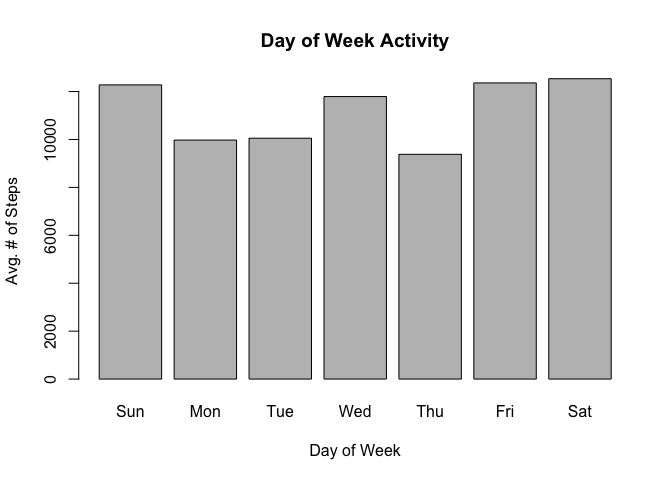
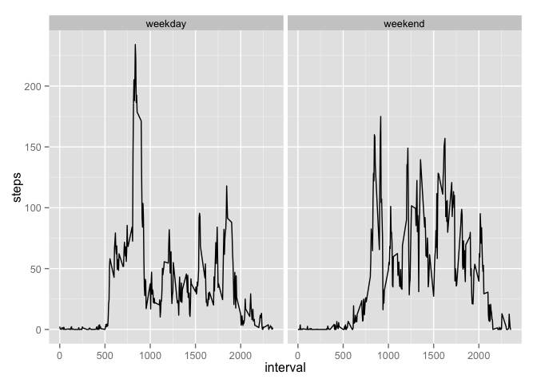

# Reproducible Research: A Quick Example Using knitr

## Loading and preprocessing the data

First, we use read.csv to read the csv file. Note that we specify na.string as "NA". The default seperator is ",". We also convert the "date" column to "Date" data type.


```r
d <- read.csv("activity.csv", sep=",", na.strings = "NA");
d$date <- as.Date(d$date);
cd <- d[complete.cases(d),];
```

## What is mean total number of steps taken per day?

First, we aggregate the total number of steps by date. We sum all steps at every interval. Then we take an average of toal number of steps by date. Note that we removed all NA values when calculating the mean total number of steps per day.


# Calculate the total number of steps taken per day


```r
dt <- setNames(aggregate(cd[, 1], list(cd$date), sum), c("date", "steps"));
```

# Make a histogram of the total number of steps taken each day


```r
library(ggplot2);
ggplot(dt, aes(steps)) + geom_histogram()
```

```
## stat_bin: binwidth defaulted to range/30. Use 'binwidth = x' to adjust this.
```



# Calculate and report the mean and median of the total number of steps taken per day

```r
meanSteps <- mean(dt[,2]);
medianSteps <- median(dt[,2]);
```

The mean number of steps per day is r as.integer(meanSteps)

The median number of steps per day is r as.integer(medianSteps)

## What is the average daily activity pattern?

# The data set contains 61 days worth of activity data performed by the object. A simple line graph should be able to show the daily activity pattern. 


```r
plot(dt[,"date"], dt[,"steps"], col = 'green', xlab='Date', ylab='Steps', main='Total Steps per Day', pch=19);
lines(dt[,"date"], dt[,"steps"], col = 'red');
```



# Make a time series plot (type = "1") of the 5-minute interval  and the average number of steps taken across all days

```r
stepsByInterval <- setNames(aggregate(cd$steps, list(cd$interval), mean), c("interval", "steps"));
library(ggplot2);
ggplot(stepsByInterval, aes(x = interval, y = steps)) + geom_line();
```



# Find out which 5-minute interval, on average across all the days in the dataset, contains the maximum number of steps? 

```r
maxInterval <- stepsByInterval[stepsByInterval$steps == max(stepsByInterval$steps), ]$interval
```

## Imputing missing values

We use MICE package to impute the missing values (NA values). We try to use PMM method to impute the missing values by using the interval ID. The reasoning behind this approach is that at certain time of the day, the object's activity should follow certain pattern. For example, the object probably goes to work and/or have lunch at the same time every day. So "time of day" can be used to reasonably guess the missing values.


```r
tdt <- d[,c("steps", "interval")];
library(mice);
```

```
## Loading required package: Rcpp
```

```
## mice 2.25 2015-11-09
```

```r
mtdt <- mice(tdt, m=5, maxit=10, meth='pmm', seed=500);
```

```
## 
##  iter imp variable
##   1   1  steps
##   1   2  steps
##   1   3  steps
##   1   4  steps
##   1   5  steps
##   2   1  steps
##   2   2  steps
##   2   3  steps
##   2   4  steps
##   2   5  steps
##   3   1  steps
##   3   2  steps
##   3   3  steps
##   3   4  steps
##   3   5  steps
##   4   1  steps
##   4   2  steps
##   4   3  steps
##   4   4  steps
##   4   5  steps
##   5   1  steps
##   5   2  steps
##   5   3  steps
##   5   4  steps
##   5   5  steps
##   6   1  steps
##   6   2  steps
##   6   3  steps
##   6   4  steps
##   6   5  steps
##   7   1  steps
##   7   2  steps
##   7   3  steps
##   7   4  steps
##   7   5  steps
##   8   1  steps
##   8   2  steps
##   8   3  steps
##   8   4  steps
##   8   5  steps
##   9   1  steps
##   9   2  steps
##   9   3  steps
##   9   4  steps
##   9   5  steps
##   10   1  steps
##   10   2  steps
##   10   3  steps
##   10   4  steps
##   10   5  steps
```

```r
summary(mtdt);
```

```
## Multiply imputed data set
## Call:
## mice(data = tdt, m = 5, method = "pmm", maxit = 10, seed = 500)
## Number of multiple imputations:  5
## Missing cells per column:
##    steps interval 
##     2304        0 
## Imputation methods:
##    steps interval 
##    "pmm"    "pmm" 
## VisitSequence:
## steps 
##     1 
## PredictorMatrix:
##          steps interval
## steps        0        1
## interval     0        0
## Random generator seed value:  500
```

```r
complete_d <- complete(mtdt, 1);
complete_d$date <- d$date;
head(complete_d);
```

```
##   steps interval       date
## 1     0        0 2012-10-01
## 2     0        5 2012-10-01
## 3     0       10 2012-10-01
## 4     0       15 2012-10-01
## 5     0       20 2012-10-01
## 6     0       25 2012-10-01
```


# Now that we have imputed all data, we can make a histogram of the total number of steps taken each day

```r
completeByInterval <- aggregate(x = complete_d$steps, by = list(complete_d$interval), mean)
colnames(completeByInterval) <- list("interval", "steps")
ggplot(completeByInterval, aes(steps)) + geom_histogram()
```

```
## stat_bin: binwidth defaulted to range/30. Use 'binwidth = x' to adjust this.
```


## Are there differences in activity patterns between weekdays and weekends?
# First, we remove all NA data. Then, we want to group all data by "day of week". After that we can calculate the total number of steps by "day of week". 1 and 7 are weekend days. We can draw a bar plot and see if there is obervable difference between activity patterns of weekdays vs. weekends.  


```r
library(lubridate);
dt$dayOfWeek <- wday(dt$date);
cdt <- dt[complete.cases(dt),];
cdt <- cdt[cdt$date!="2012-10-02" & cdt$date != "2012-11-15",];
wdt<-setNames(aggregate(cdt[, 2], list(cdt$dayOfWeek), mean), c("dayOfWeek", "avSteps"));
barplot(wdt$avSteps, main="Day of Week Activity", xlab="Day of Week", ylab = "Avg. # of Steps", names.arg=c("Sun", "Mon", "Tue", "Wed", "Thu", "Fri", "Sat"), color="red");
```

```
## Warning in plot.window(xlim, ylim, log = log, ...): "color" is not a
## graphical parameter
```

```
## Warning in axis(if (horiz) 2 else 1, at = at.l, labels = names.arg, lty =
## axis.lty, : "color" is not a graphical parameter
```

```
## Warning in title(main = main, sub = sub, xlab = xlab, ylab = ylab, ...):
## "color" is not a graphical parameter
```

```
## Warning in axis(if (horiz) 1 else 2, cex.axis = cex.axis, ...): "color" is
## not a graphical parameter
```



It appears that the object is more active during weekend (Friday, Saturday and Sunday) compared with weekdays. There is also a (smaller) peak activity on Wednesday. There may be a routin activity on Wednesday for the object which makes the object more active on Wednesday compared with other weekdays.   
# Another way to look at this: Make a panel plot containing a time series plot (type="l") of the 5-minute interval (x-axis) and the average number of steps taken, averaged across all weekday days or weekend days (y-axis).

```r
cd$weekdays <- weekdays(as.Date(cd$date));
w <- ifelse(cd$weekdays == 'Saturday' | cd$weekdays == 'Sunday', "weekend", "weekday");
cd$week <- as.factor(w);
meanStepsTaken <- aggregate(cd$steps, by = list(cd$interval, cd$week), mean);
colnames(meanStepsTaken) <- list("interval", "week", "steps");
ggplot(meanStepsTaken, aes(x = interval, y = steps)) + geom_line() + facet_grid(. ~ week);
```


